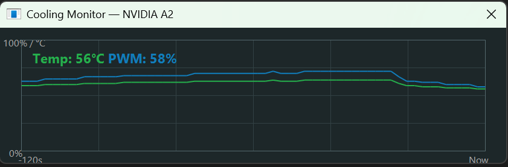
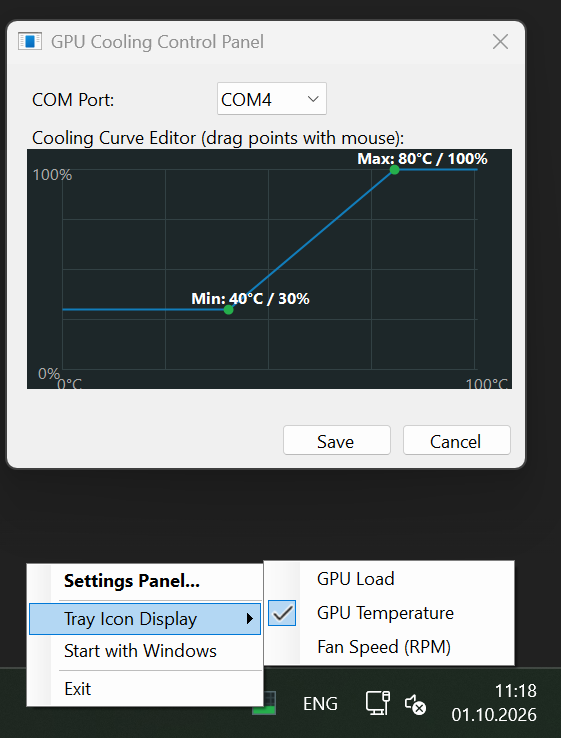
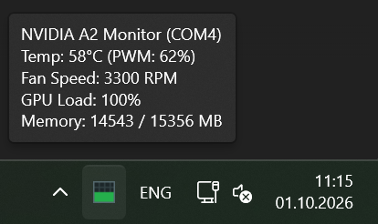

# NVIDIA Tesla Smart Fan Controller 🌬️🤖

An automatic, ultra-lightweight smart fan controller for passive server-grade GPUs (**NVIDIA Tesla A2, P4, T4**, etc.) in desktop PCs, built with a **.NET WinForms (NVML)** engine and an **Arduino Nano** driver.

---

## 📸 Screenshots

<p align="center">
  
  <br>
  <i>Animated Tray Icon Grid</i>
</p>

<p float="left" align="center">
  
  
</p>

<p float="left">
  <span style="display: inline-block; width: 48%; text-align: center;"><i>Cooling Curve Editor UI</i></span>
  <span style="display: inline-block; width: 48%; text-align: center;"><i>Real-Time Temperature & PWM Graph</i></span>
</p>

---

## ✨ Features
* **Zero-CPU Overhead Monitoring:** Uses `nvml.dll` to directly query driver memory without heavy shell execution.
* **Hardware Failsafe Protection:** Arduino watchdog spins the fan to 100% if the app closes or freezes for 6 seconds.
* **Silent 25 kHz PWM Signal:** Reconfigured hardware timers eliminate motor buzzing at low speeds.
* **Animated Tray Icon & Monitor:** Real-time tracking and double-click streaming graphs for temperature and PWM.
* **Interactive Cooling Curve UI:** Easily adjust custom cooling targets via the graphical editor.

---


## 🔌 Hardware Wiring Diagram
* **Fan GND (Black/Grey)** -> **Arduino GND** AND **12V Power Supply Minus (-)** (*Mandatory: Common ground connection!*)
* **Fan 12V (Red)** -> **12V Power Supply Plus (+)**
* **Fan PWM (Blue)** -> **Pin D9 on Arduino Nano**
* **Fan Tachometer / Tach (Yellow/White)** -> **Pin D2 on Arduino Nano** (*Hardware Interrupt INT0*)

---

## 🚀 Quick Start / Deployment

### 1. Flash the Arduino
1. Open the sketch provided in the `/Arduino` directory inside your Arduino IDE.
2. Select your **Arduino Nano** (ATmega328P) board and upload the code.

### 2. Get the Windows App

<p align="left">
  <a href="https://github.com">
    
  </a>
</p>

Download the pre-compiled executable directly using the button above, or compile it from source within the project folder using .NET CLI commands:

<details>
<summary>🛠️ Click to view Manual Compilation Guide</summary>

Navigate to your project directory in terminal and run:
```bash
dotnet add package Microsoft.Win32.Registry
dotnet publish -c Release -r win-x64 --self-contained false -p:PublishSingleFile=true
```
Grab your standalone `TeslaFanController.exe` from the `bin/Release/.../publish/` folder and drop it into your preferred storage directory.
</details>


### 3. Execution & Configuration
1. Run the app (no admin rights needed for core NVML reading).
2. Configure `config.txt` and fine-tune cooling lines via the tray settings panel.
3. Enable **"Start with Windows"** to automate GPU cooling on startup.

---

## 📄 License
This project is licensed under the MIT License - see the [LICENSE](LICENSE) file for details.
