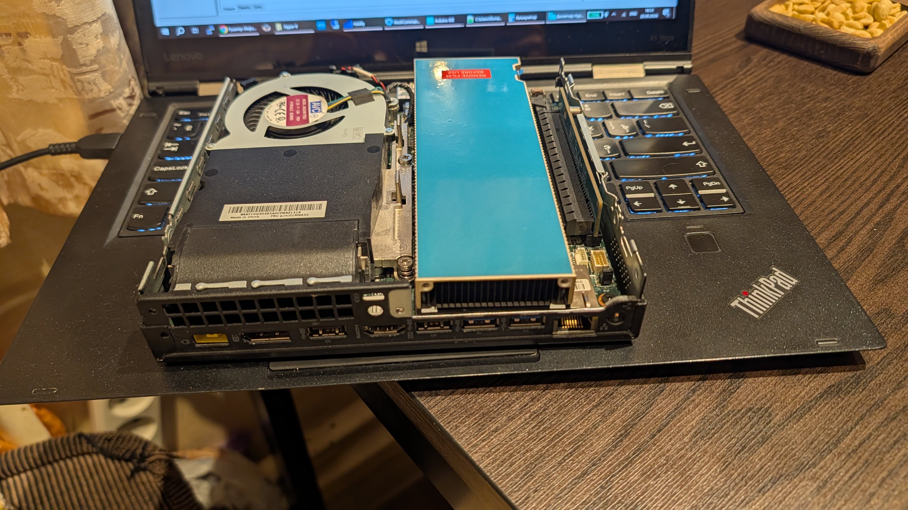
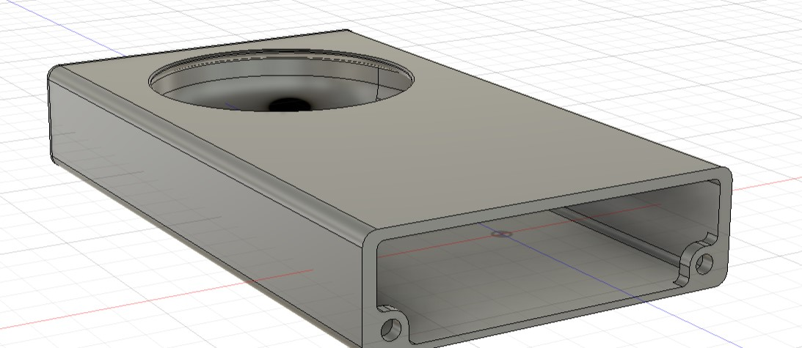
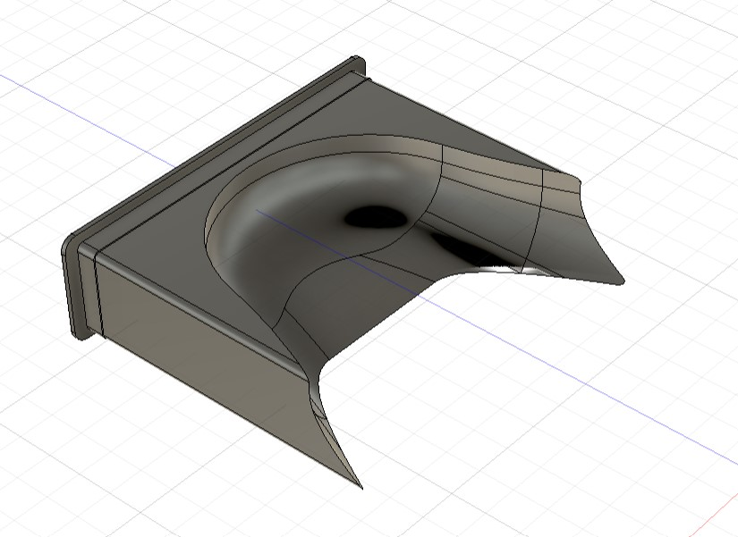
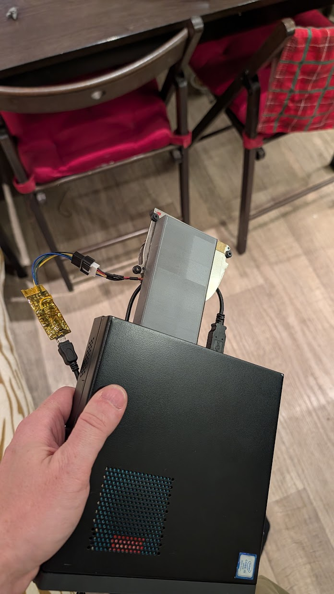

# NVIDIA Tesla Smart Fan Controller 🌬️🤖

An automatic, ultra-lightweight smart fan controller for passive server-grade GPUs (**NVIDIA Tesla A2, P4, T4**, etc.) in desktop PCs, built with a **.NET WinForms (NVML)** engine and an **Arduino Nano** driver.

---

## 📜 The Story Behind the Project (Background)

This project was born out of a very specific hardware challenge. I wanted to build a compact, high-performance AI and media node using a **Lenovo ThinkCentre M920x Tiny** micro-PC and a low-profile, passive enterprise accelerator — the **NVIDIA Tesla A2**. 

<p align="center">
  
  <br>
  <i>NVIDIA Tesla A2 passive heatsink aligned with the chassis exhaust</i>
</p>

However, two major roadblocks immediately appeared:
1. **Locked Embedded Controller (EC):** The Lenovo motherboard completely blocks any third-party software control over the system fan bus. Utilities like SpeedFan, FanCtrl, or Notebook FanControl are entirely powerless here.
2. **Passive Server Cooling:** Server GPUs like the Tesla A2 do not have an onboard fan connector or fan controller. They rely purely on the massive airflow of server racks, meaning that inside a desktop or mini-PC, the card would quickly overheat and throttle under any AI or compute load.

To solve this, I designed a **hybrid hardware-software cooling system**. Instead of fighting the locked Lenovo EC, I installed a dedicated external cooling fan onto the Tesla A2 and wired it directly to an **Arduino Nano**. 

The C# Windows application silently monitors the GPU core via the native **NVIDIA Management Library (NVML)**, calculates the required PWM percentage, and streams it to the Arduino. To eliminate any chance of overheating if the software crashes, the Arduino runs a hardware watchdog timer — if it doesn't hear from Windows for 6 seconds, it overrides everything and spins the fan to 100%.

The result is a whisper-quiet mini-PC at idle, and a perfectly cooled, stable enterprise GPU under full load!

### 🌪️ Why Exhaust (Pull) Configuration Instead of Intake (Push)?
A common question in cooling design is why this system is set to pull hot air *away* from the GPU heatsink and exhaust it out of the chassis, rather than blowing cold air directly *onto* it. There are three major engineering reasons for this setup, **backed by real-world thermal testing**:

> ⚠️ **Empirical Proof:** During development, an intake (push) configuration was fully tested using the exact same blower fan. Under a heavy compute/AI load, the results were disastrous — the GPU core temperature rapidly broke through **80°C** and kept climbing due to air stagnation. Switching to the exhaust (pull) layout instantly dropped and stabilized the temps at **60-63°C**.

1. **Server Heatsink Aerodynamics:** The passive radiator on the Tesla A2 is geometrically optimized for straight-through, tunnel-like airflow. High-pressure blower fans (shrouded laptop impellers) work significantly better by creating a low-pressure vacuum inside the shroud, smoothly drawing air *through* the dense fins along their native path, rather than hitting them at a dead-angle and creating turbulent stall zones.
2. **Component-Wide Thermal Relief:** By vacuuming air out through the back, cold ambient air is naturally drawn into the tiny Lenovo chassis through its side ventilations. This airflow travels across the entire surface of the Tesla A2, successfully cooling not just the core chip, but also the VRAM and critical VRM power delivery zones before being ejected.
3. **Preventing the "Oven Effect":** Blowing air *into* the heatsink would trap high-velocity, 65°C+ air inside the incredibly tight spaces of the micro-PC, heating up adjacent system memory, NVMe SSDs, and the motherboard components. The exhaust configuration cleanly isolates the GPU's thermal loop from the rest of the host system.

---

## 📸 Screenshots

<p float="left" align="center">
  
  
</p>

<p align="center">
  
  <br>
  <i>Animated Tray Icon Grid</i>
</p>

<p float="left">
  <span style="display: inline-block; width: 48%; text-align: center;"><i>Cooling Curve Editor UI</i></span>
  <span style="display: inline-block; width: 48%; text-align: center;"><i>Real-Time Temperature & PWM Graph</i></span>
</p>

<p float="left" align="center">
  
  
</p>

<p float="left">
  <span style="display: inline-block; width: 48%; text-align: center;"><i>Custom Fan Shroud 3D Model</i></span>
  <span style="display: inline-block; width: 48%; text-align: center;"><i>Internal Airflow Duct Geometry (Autodesk Fusion)</i></span>
</p>

---

## ✨ Features
* **Zero-CPU Overhead Monitoring:** Uses `nvml.dll` to directly query driver memory without heavy shell execution.
* **Hardware Failsafe Protection:** Arduino watchdog spins the fan to 100% if the app closes or freezes for 6 seconds.
* **Silent 25 kHz PWM Signal:** Reconfigured hardware timers eliminate motor buzzing at low speeds.
* **Animated Tray Icon & Monitor:** Real-time tracking and double-click streaming graphs for temperature and PWM.
* **Interactive Cooling Curve UI:** Easily adjust custom cooling targets via the graphical editor.

---


## 🔌 Hardware Specs & Wiring Diagram

The entire cooling system is highly efficient and runs **completely off a single USB port (5V)**, eliminating the need for any external 12V power bricks. 

### Hardware components used:
* **Arduino Nano** (ATmega328P) wrapped in Kapton tape for insulation.
* **5V Laptop Blower Fan** (with PWM support).
* Standard **Mini-USB cable** for simultaneous 5V power supply and serial data transfer from Windows.

### 📐 Wiring Layout:
* **Fan GND** -> **Arduino GND**
* **Fan 5V VCC** -> **Arduino 5V pin**
* **Fan PWM** -> **Arduino Pin D9**
* **Fan Tachometer / Tach** -> **Arduino Pin D2** (*Hardware Interrupt*)

<p align="center">
  
  <br>
  <i>Real-world hardware setup: Arduino Nano in Kapton tape powered via Mini-USB</i>
</p>


---

## 🚀 Quick Start / Deployment

### 0. 3D Printing
Print the custom fan shroud located in the `/3D_Models` folder using PETG or ABS filament (recommended due to GPU operating temperatures) to securely mount your external fan.

### 1. Flash the Arduino
1. Open the sketch provided in the `/Arduino` directory inside your Arduino IDE.
2. Select your **Arduino Nano** (ATmega328P) board and upload the code.

### 2. Get the Windows App

<p align="left">
  <a href="https://github.com/romkaork-stack/NVIDIA-Tesla-Smart-Fan-Controller/releases/tag/v1.0.0">
    
  </a>
</p>

Download the pre-compiled executable directly using the button above, or compile it from source within the project folder using .NET CLI commands:

<details>
<summary>🛠️ Click to view Manual Compilation Guide</summary>

Navigate to your project directory in terminal and run:
```bash
dotnet add package Microsoft.Win32.Registry
dotnet publish -c Release -r win-x64 --self-contained false -p:PublishSingleFile=true
```
Grab your standalone `TeslaFanController.exe` from the `bin/Release/.../publish/` folder and drop it into your preferred storage directory.
</details>


### 3. Execution & Configuration
1. Run the app (no admin rights needed for core NVML reading).
2. Configure `config.txt` and fine-tune cooling lines via the tray settings panel.
3. Enable **"Start with Windows"** to automate GPU cooling on startup.

---

## 📄 License
This project is licensed under the MIT License - see the [LICENSE](LICENSE) file for details.

---

## 🤝 Credits
This project, including the entire .NET background application, low-level NVML logic, interactive GUI, and custom Arduino firmware, was co-created, designed, and fully written in collaboration with **Google Gemini**.
